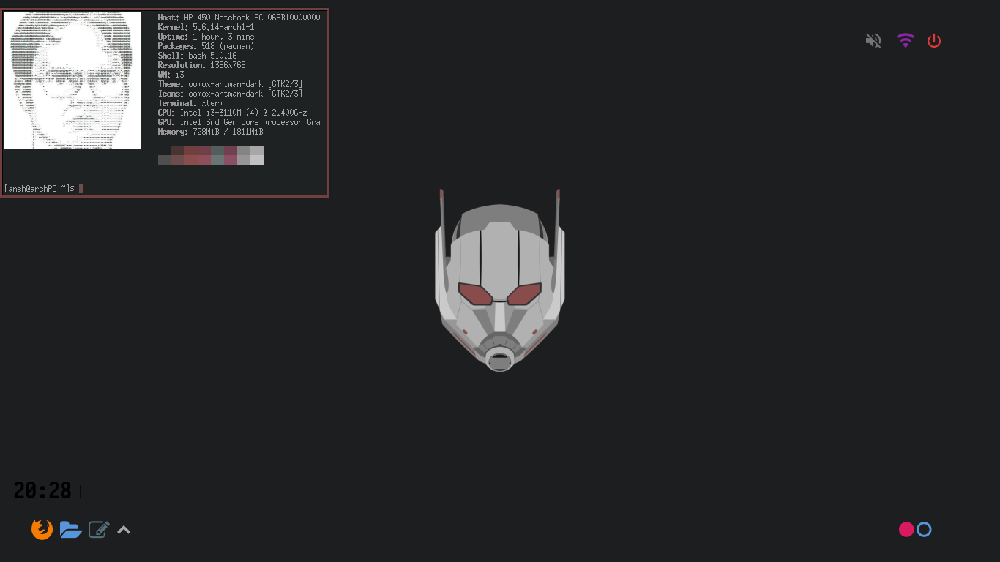

# dotfiles
# Custom Theme and Setup for Arch Linux
* Distro - Arch
* Shell - bash
* Font - nerd font
* WM - i3-gaps
* Compositor - picom
* Bar - polybar
* BarTheme - polybar-theme
* GTK Theme - custom as per the color scheme
* ColorScheme - pywal

